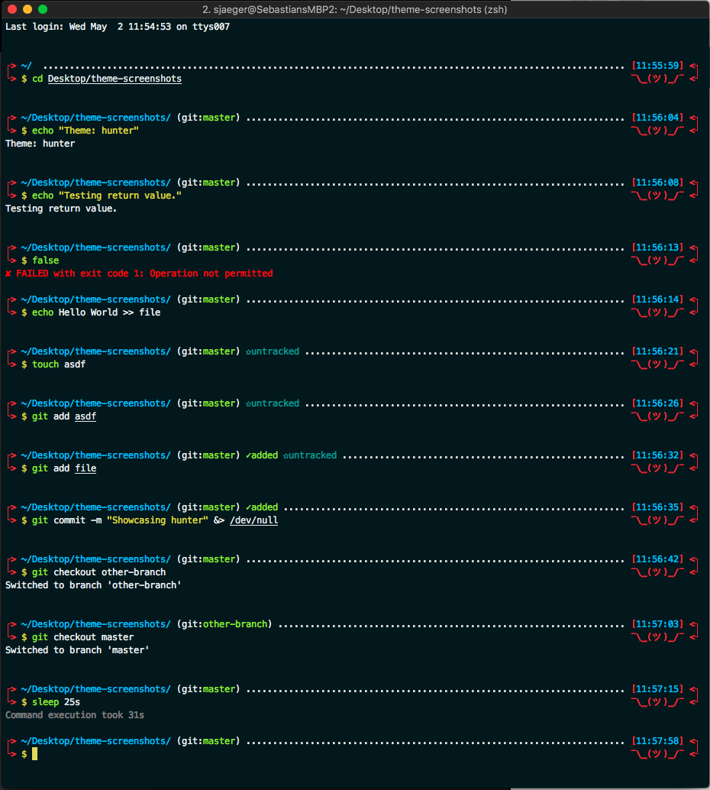
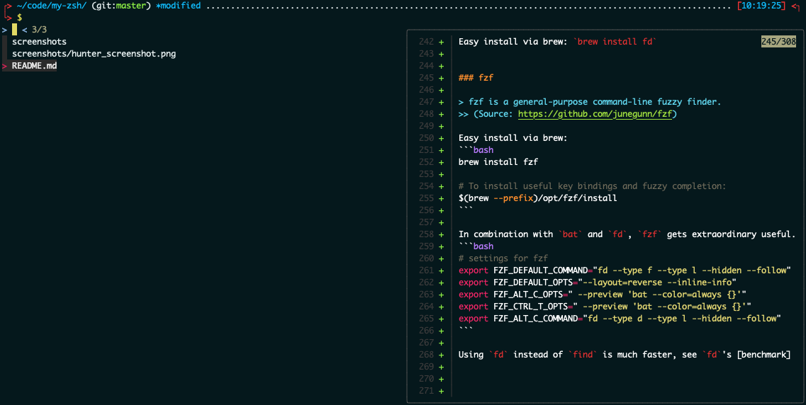

# My Personal Zsh Setup with iTerm2

This repository shows the setup of my terminal and some other tools/aliases. All theme and scheme files are provided in an other [repository](https://github.com/se-jaeger/hunter-zsh-scheme), have a look!  


## Tool Stack

- macOS
- [iTerm2](https://www.iterm2.com)
- [Zsh](http://zsh.org)
- [oh-my-zsh](http://ohmyz.sh)


### iTerm2

> **What is iTerm2?**  
> iTerm2 is a replacement for Terminal and the successor to iTerm. It works on Macs with macOS 10.10 or newer. iTerm2 brings the terminal into the modern age with features you never knew you always wanted.
>> (Source: https://www.iterm2.com)

I extensively use the `Split Panes`, `Mouseless Copy` and of course the `256 Colors` + `Configurability`. There are lot more for example the `Inline Images`. Take a [look](http://iterm2.com/features.html).


### Zsh

Zsh is like a superset of the standard `BASH`. It adds the following advantages:
- better autocompletion (case insensitive..)
- path expansion (cd /v/w [tab] == cd /var/www)
- syntax highlighting
- spelling correction
- ... much more useful plugins
- oh-my-zsh


### oh-my-zsh

> Oh My Zsh is an open source, community-driven framework for managing your zsh configuration.
>> (Source: https://github.com/robbyrussell/oh-my-zsh)

It also comes with a lot of `themes` and `plugins`.


## 1. Install Required Tools

To activate changes you can restart iTerm2, if you did some changes on them, or reload the zsh config file: `source ~/.zshrc`


### Zsh - Deprecated

Zsh is the default shell since macOS 10.15.

For older versions:

> The easiest way to install Zsh is using [brew](https://brew.sh).  
> Therefore run: `brew install zsh`


### oh-my-zsh

As you can see on: http://ohmyz.sh - use the following command to install oh-my-zsh.  
`sh -c "$(curl -fsSL https://raw.github.com/robbyrussell/oh-my-zsh/master/tools/install.sh)"`


### iTerm2

Download and install iTerm2. [Click](https://www.iterm2.com/downloads.html)  
Or use brew: `brew cask install iterm2`


## 2. Setup iTerm2

### Create personal Profile

- iTerm2 -> Preferences -> tab "Profiles" -> add <your-profile-name>

### Change iTerm2 Colors

I changed colors of iTerm2 and provide the changes in an `itermcolors` file.

1. Download the `itermcolors` file. You can use the following command to automatically store it in your `oh-my-zsh` installation path, subdir `custom`, or use a custom one.
    - `curl https://raw.githubusercontent.com/se-jaeger/hunter-zsh-scheme/master/hunter.itermcolors > ${ZSH_CUSTOM:-~/.oh-my-zsh/custom}/hunter.itermcolors`
    - https://github.com/se-jaeger/hunter-zsh-scheme/blob/master/hunter.itermcolors
2. Import `hunter.itermcolors` (or whatever you named it) into iTerm2
    - iTerm2 -> Preferences -> tab "Profiles" -> select <your-profile-name> -> tab "Colors" -> Color Presets... -> Import... -> choose the `hunter.itermcolors` file
3. Select the scheme `hunter` (or whatever you named it)
    - iTerm2 -> Preferences -> tab "Profiles" -> select <your-profile-name> -> tab "Colors" -> Color Presets... -> `hunter`


### Enable Word Jumps and Delete Whole Words in iTerm2

- iTerm2 -> Preferences -> tab "Profiles" -> select <your-profile-name> -> tab "Keys" -> Load Presets... -> select "Natural Text Editing"

(Source: https://apple.stackexchange.com/a/293988)

When asked "Remove all key mappings before loading preset?" klick "Keep".

### Change iTerm2 Scheme

- iTerm2 -> Preferences -> tab "Appearance" -> Theme -> slect "Dark"

### Increase Scroll Buffer

- iTerm2 -> Preferences -> tab "Profiles" -> select <your-profile-name> -> tab "Terminal" -> tick "Unlimited scrollback"

### Set <your-profile-name> as Default

- iTerm2 -> Preferences -> tab "Profiles" -> select <your-profile-name> -> Other Actions -> Set as Default

## 3. Install Zsh Plugins

### Install Zsh Plugin: zsh-autoactivate-environment

> Switches the virtual environment (conda and virtualenv) as you move between directories.
>> (Soruce: https://github.com/se-jaeger/zsh-autoactivate-environment) 

1. Run `git clone https://github.com/se-jaeger/zsh-autoactivate-environment ${ZSH_CUSTOM:-~/.oh-my-zsh/custom}/plugins/zsh-autoactivate-environment`
2. Change your `~/.zshrc` file and add `zsh-autoactivate-environment` to the plugins like:
```
plugins=(
  # other plugins
  zsh-autoactivate-environment
)
```
(Source: https://github.com/se-jaeger/zsh-autoactivate-environment#installation-and-prerequisites)


### Install Zsh Plugin: zsh-autosuggestions

> It suggests commands as you type, based on command history.
>> (Source: https://github.com/zsh-users/zsh-autosuggestions#zsh-autosuggestions)

1. Run `git clone https://github.com/zsh-users/zsh-autosuggestions ${ZSH_CUSTOM:-~/.oh-my-zsh/custom}/plugins/zsh-autosuggestions`
2. Change your `~/.zshrc` file and add `zsh-autosuggestions` to the plugins like:
```
plugins=(
  # other plugins
  zsh-autosuggestions
)
```
(Source: https://github.com/zsh-users/zsh-autosuggestions#oh-my-zsh)


### Install Zsh Plugin: zsh-syntax-highlighting

> It enables highlighing of commands whilst they are typed at a zsh prompt into an interactive terminal. This helps in reviewing commands before running them, particularly in catching syntax errors.
>> (Source: https://github.com/zsh-users/zsh-syntax-highlighting#zsh-syntax-highlighting-)

1. Run `git clone https://github.com/zsh-users/zsh-syntax-highlighting.git ${ZSH_CUSTOM:-~/.oh-my-zsh/custom}/plugins/zsh-syntax-highlighting`
2. Change your `~/.zshrc` file and add `zsh-syntax-highlighting` to the the plugins like:
```
plugins=(
  # other plugins
  zsh-syntax-highlighting
)
```
(Source: https://github.com/zsh-users/zsh-syntax-highlighting/blob/master/INSTALL.md#oh-my-zsh)

### Install Zsh Plugin: zsh-history-substring-search

> This is a clean-room implementation of the Fish shell's history search feature, where you can type in any part of any command from history and then press chosen keys, such as the UP and DOWN arrows, to cycle through matches.
>> (Source: https://github.com/zsh-users/zsh-history-substring-search#zsh-history-substring-search)

1. Run `git clone https://github.com/zsh-users/zsh-history-substring-search ${ZSH_CUSTOM:-~/.oh-my-zsh/custom}/plugins/zsh-history-substring-search`
2. Change your `~/.zshrc` file and add `zsh-history-substring-search` at the end of the plugins like. Just to make sure it is loaded after `zsh-syntax-highlighting`:
```
plugins(
  # other plugins

  # should be last plugin loaded
  history-substring-search
)
```
(Source: https://github.com/zsh-users/zsh-history-substring-search#install)


## 4. Setup oh-my-zsh Theme

I created a `zsh-theme` file, which provide different features and change appearance, see [Click](https://github.com/se-jaeger/hunter-zsh-scheme).

1. Download the `zsh-theme` file. You can use the following command to automatically store it in the `themes` dir of your installation directory, or download it yourself.
    - `curl https://raw.githubusercontent.com/se-jaeger/hunter-zsh-scheme/master/hunter.zsh-theme > ${ZSH_CUSTOM:-~/.oh-my-zsh/custom}/themes/hunter.zsh-theme`
    - https://github.com/se-jaeger/hunter-zsh-scheme/blob/master/hunter.zsh-theme
2. Activate the theme in `~/.zshrc` file: `ZSH_THEME="hunter"` (or whatever you named it)


# Screenshots



# Further Tooling

## Useful Command Line Tools

A collection of different tools I'm using.


### trash

Moves file and folders to Trash, like the `Move to Trash` option in context menu.  
Easy install via brew: `brew install trash`


### tree 

> Tree is a recursive directory listing command that produces a depth indented listing of files.
>> (Source: http://mama.indstate.edu/users/ice/tree/) 

Easy install via brew: `brew install tree`


### tldr

> Simplified and community-driven man pages.
>> (Source: http://tldr.sh)

Easy install via brew: `brew install tldr`


### lsd

> The next gen ls command
>> (Source: https://github.com/Peltoche/lsd)

Easy install via brew: `brew install lsd` 


### bat

> A cat(1) clone with syntax highlighting and Git integration.
>> (Source: https://github.com/sharkdp/bat)

Easy install via brew: `brew install bat`

I'm using always `bat` instead of `cat`. Simply add the following to your `~/.zshrc`: `alias cat="bat"`

To use `bat` for `man` pages additionally add the following:
```bash
# use bat for man pages
export MANPAGER="sh -c 'col -bx | bat -l man -p'"
export BAT_PAGER="less -R"
```


### fd

> fd is a simple, fast and user-friendly alternative to find.
>> (Source: https://github.com/sharkdp/fd)

Easy install via brew: `brew install fd`


### fzf

> fzf is a general-purpose command-line fuzzy finder.
>> (Source: https://github.com/junegunn/fzf)

Easy install via brew:
```bash
brew install fzf

# To install useful key bindings and fuzzy completion:
$(brew --prefix)/opt/fzf/install
```

In combination with `bat` and `fd`, `fzf` gets extraordinary useful. For this add the following to `~/.zshrc`:
```bash
# settings for fzf
export FZF_DEFAULT_COMMAND="fd --type f --type l --hidden --follow"
export FZF_DEFAULT_OPTS="--layout=reverse --inline-info"
export FZF_ALT_C_OPTS=" --preview 'bat --color=always {}'"
export FZF_CTRL_T_OPTS=" --preview 'bat --color=always {}'"
export FZF_ALT_C_COMMAND="fd --type d --type l --hidden --follow"
```

Using `fd` instead of `find` is much faster, see `fd`'s [benchmark](https://github.com/sharkdp/fd#benchmark) and `bat` instead of `cat` for previews is much nicer because of it's syntax highlighting:




#### Hints

See the following for a font workaround:  https://github.com/Peltoche/lsd/issues/199#issuecomment-494218334

Use the following in your `~/.zshrc` to always show the directory's content when stepping into it.
```bash
cd() {
    builtin cd "$@"
    l
}
```


## Useful Aliases

A collection of aliases I'm using.

Add them to your `~/.zshrc`

```
alias del="trash"
alias ..="cd .."
alias ls="lsd"
alias search="l | grep"
alias cat="bat"
```

A lot of aliases which are provided by oh-my-zsh

```
gst='git status'
ga='git add'
gaa='git add --all'
gcmsg='git commit -m'
gp='git push'
```

For a list of all aliases type `alias`